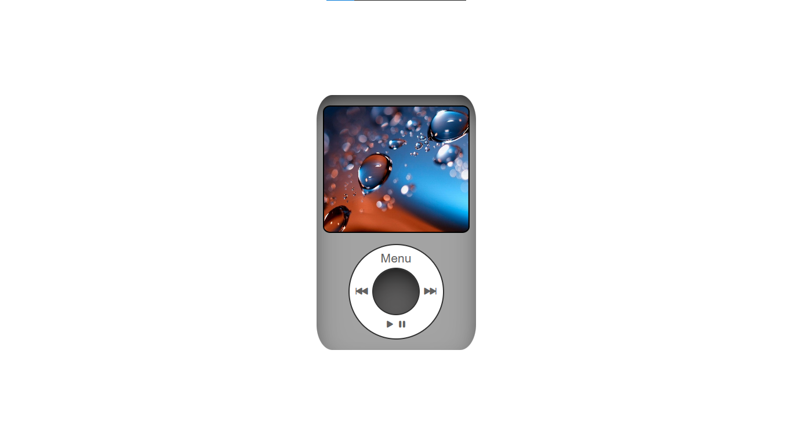

# i Pod Project

The Simple iPod Project is a React-based application mimicking an iPod interface. It consists of multiple screens such as Music, Settings, Games, and Cover Flow, which can be navigated through a menu system. Users can toggle between different screens and access functionalities like playing music, adjusting settings, exploring games, and visualizing album covers. The project aims to replicate the iconic iPod user experience, offering a simple yet intuitive interface for users to interact with different features.

## Technologies Used
 ## Skills

## Steps to Setup

- Clone the repository : **`git clone https://github.com/Akash-Verma-2000/i-pod.git`**
- Install dependencies : **`npm install`**
- Run the server from the index.js file : **`npm start`**

## Screenshot

## Author

Akash Verma

## Contact me

  

## License

This project is licensed under the ISC License.
